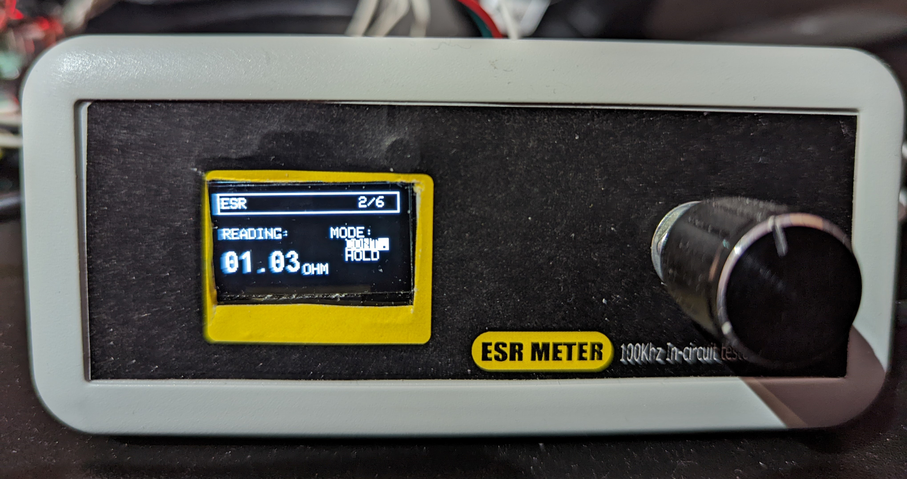
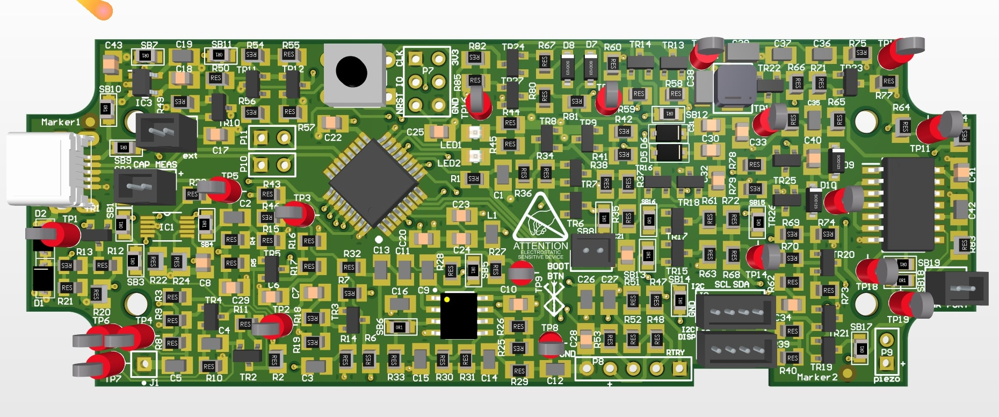
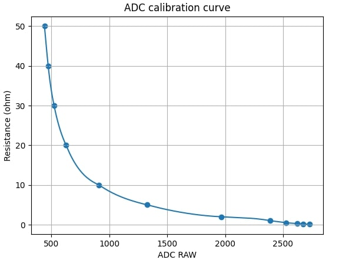

# ESR meter

A low cost and low power ESR meter design for in-circuit measurements

## Features

- Live ESR preview mesaurement of capacitor
- Accurate measurement with non-linear ADC estimation equations
- Power switch and navigation with rotrary encoder
- Internal self calibration and auto-zeroing network
- Low power management circuit and adjustable auto power-off timer

## Specs

| Parameter                   | Value  |   Units |
| :-------------------------- | :----: | ------: |
| Input power supply          |   5    |       V |
| Display type                |  OLED  |     N/A |
| ESR Range                   | 0 - 50 | &#8486; |
| ESR Resolution              |  0.1   | &#8486; |
| Test frequency              |   100   |     KHz |
| DUT Capacitance MAX voltage |  ~100  |      mV |
| Capacitor support range |  1 - 10000  |      uF |

&nbsp;

## Screenshots

